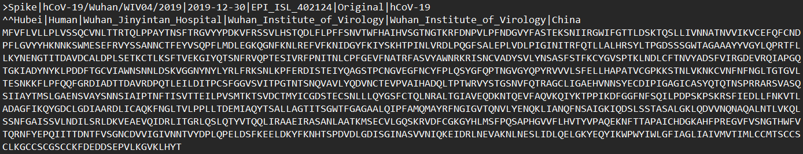

# Modeling-SARS-CoV-2-Viral-Escape-Mutations

## Description
This directory comprises the folders containing the source code, data and figures for the research article: 
> _Modeling-SARS-CoV-2--Viral-Escape-Mutations-with-Natural-Language-Processing-Methods_

## src
This folder contains the python source code for analysing the mutation dynamics of the SARS-CoV-2 genome:

> spatial

* This folder contains the python scripts for our spatial escape model using natural language processing methods

> temporal

* This folder contains the python scripts for our time-series prediction model using temporal attention network

## data
This folder contains the genome sequence data exported from GISAID EpiFlu / NCBI Genbank database:
* Each data file is provided in a variety of readable text formats (_.fasta, _.fa, .aln, .txt_)
* Text header contains relevant metadata on each sample (_sequence ID, collection date, country of origin_)
* Text body contains a string of characters representing the corresponding RNA nucleotides or amino acids

> **Sample data file:**   
>           
> 

The relevant datasets can be downloaded directly from gisaid.org with a registered user account.

## figures
This folder contains all the output figures and results generated from our analyses.

## How to Run the Code:
* Download the python scripts from _src_ folder and place them in a directory. 
* Download the sequence text files from _data_ folder or GISAID database, placing them in the same directory.
* Run the relevant python scripts to train the model, then check your directory for the output results and figures.
